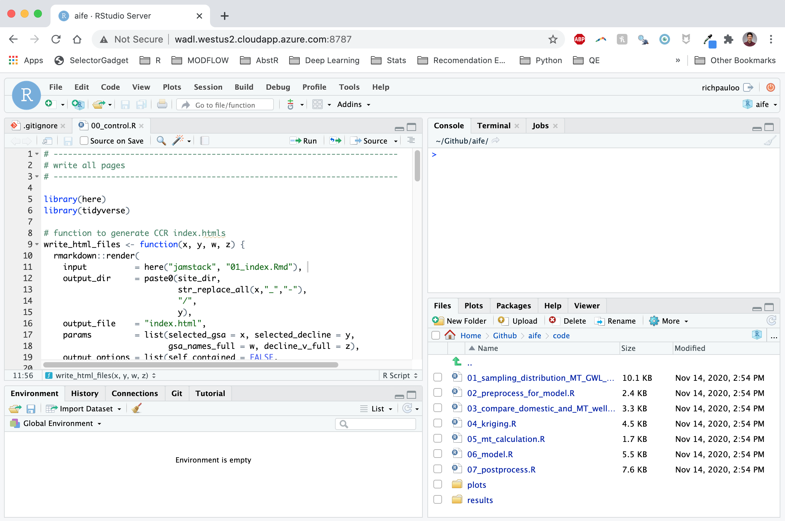
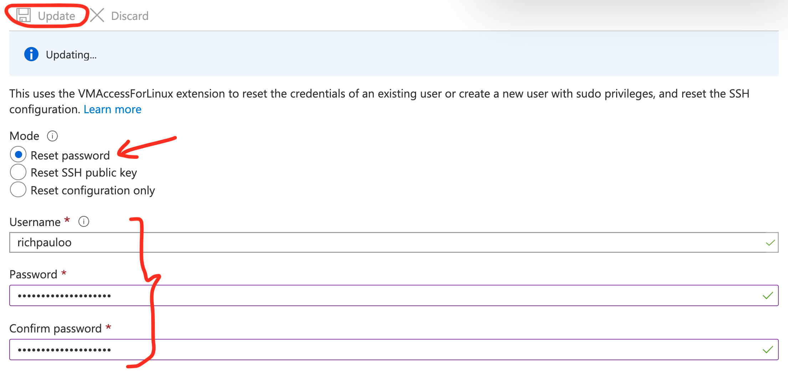
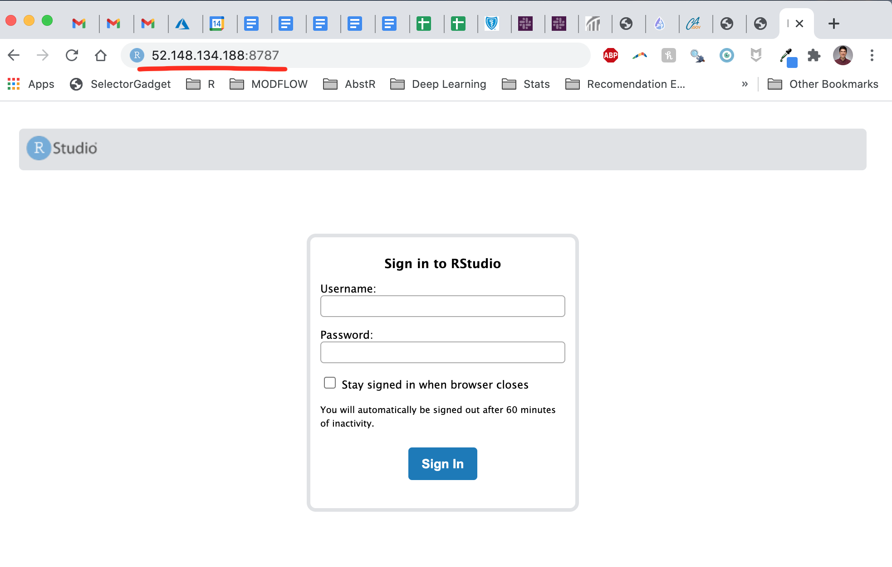
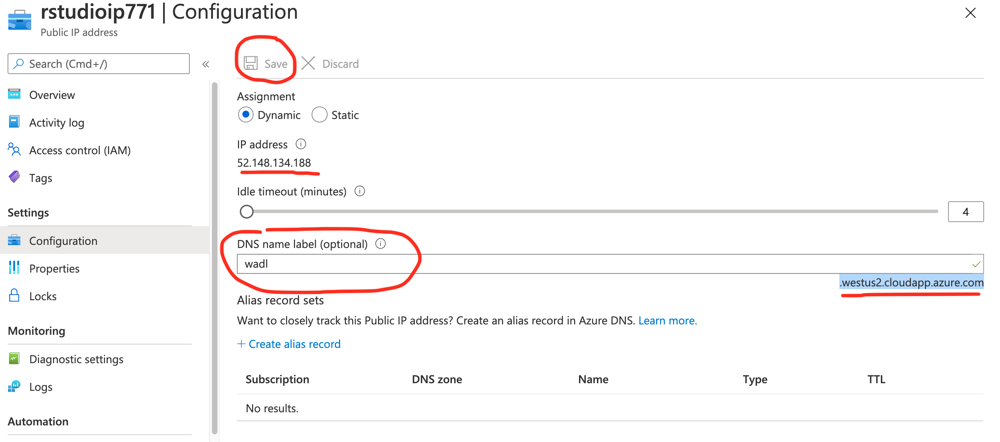
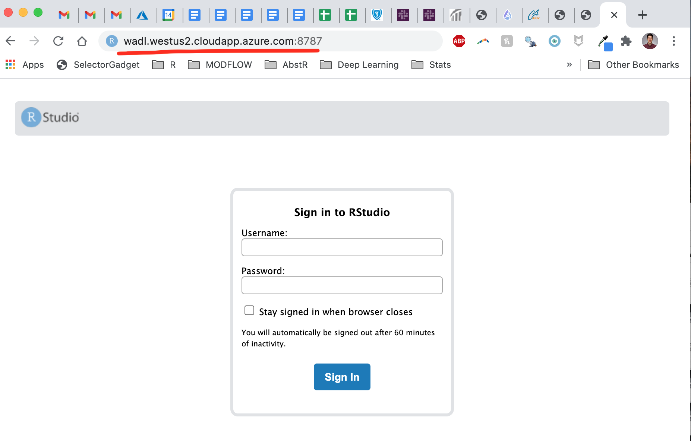

  

# Introduction 

Setting up RStudio online is easier than you may think.  

I needed to set up an Azure Virtual Machine to create an online development environment, and went through a few different blogs troubleshooting some of the aspects of configuring RStudio Server ([this](https://medium.com/techinpieces/practical-azure-how-to-enable-ssh-on-azure-vm-84d8fba8103e) and [this](https://techcommunity.microsoft.com/t5/educator-developer-blog/hosting-rserver-and-rstudio-on-azure/ba-p/744389) were particularly helpful but also dated, hence this guide).  

The setup guide below is my attempt to remember this workflow for the future, but hopefully it will help you sail through the setup.  


# 1. Create the VM

Head to [Azure](poral.azure.com) and create a new **Ubtuntu 18.04** resource.  

Accept default settings. These can be changed later, so don't worry about these too much.  

Download the key pair, which will help you `ssh` into the VM later.  

Allow inbound Network Rules for ports 22, 80, and 443 (SSH, HTTP, and HTTPS respectively).  

Example:  

```
Source: Any (default)
Source port range: * (default)
Destination: Any (default)
Destination port ranges: 22
Protocol: TCP
Action: Allow
Priority: 330 (default)
Name: Enable 22 (can be anything you can identify)
Select "Add"
```


# 2. `ssh` into the VM

Download the key pair and move it to `~/.ssh` on your computer. You can either `mv` the file, or use `Shift + Cmd + .` in your finder to show hidden files, and navigate to `~/.ssh`.  

The `.pem` file must be properly protected in order to use it to ssh into the VM. Once you've moved the file to `~/.ssh`, make it so that only you can read it:  

```bash
chmod 400 ~/.ssh/username.pem
```   

Now you're ready to access the VM. In the terminal enter:  

```bash
ssh -i ~/.ssh/username.pem <username>@<ipaddress>
```  

where the username is what you input in set 1 while setting up the VM, and the ipaddress is the public IP address of the VM.  


# 3. Install R and RStudio Server

Once you're in, ensure Ubuntu is up to date, upgrade, and install `R`.  

```bash
sudo apt-get update
sudo apt-get upgrade
sudo add-apt-repository ppa:marutter/rrutter
sudo apt update
sudo apt-get install r-base
```

Now it's time to install Linux libraries that many popular R packages depend on. For example, I rely on `gdal` for geospatial processing with `sf`. Below are the libraries that help me get by in daily life:  

```bash
sudo apt-get install \
  # v8
  libv8-3.14-dev \
  # geospatial libs
  libgdal-dev gdal-bin libproj-dev proj-data proj-bin libgeos-dev \
  # interactive web graphics
  libudunits2-dev \
  # igraph
  libxml2 libxml2-dev \
  # Graphics packages
  libcairo2-dev \
  # httr
  libssl-dev libcurl4-openssl-dev \
  # for redirects
  apache2
```

Now it's time to install RStudio Server. The the most up to date version of RStudio Server [can be found here](https://rstudio.com/products/rstudio/download-server/debian-ubuntu/0). At the time of writing, for Ubtuntu 18.04, it's given in line 2 below, but may be different when you read this. Copy and paste the appropriate link:    

```bash
sudo apt-get install gdebi-core
wget https://download2.rstudio.org/server/bionic/amd64/rstudio-server-1.3.1093-amd64.deb
sudo gdebi rstudio-server-1.3.1093-amd64.deb
```

Now we need to make sure there's a port open for RStudio Server. Under the "Networking" tab in the Azure VM dashboard, add an inbound port 8787, which is the default RStudio Server port.  

Lastly, you need to add a password for the user to log in (we've been doing it with a `.pem` key file via ssh so far). In the console for the VM, go to `Support + Troubleshooting -> reset password`, enter a new password and click the "save" button. It will be a new password because you haven't yet set one.  

  

Now you should be able to navigate to `<public IP address>:8787` and login with your username and password.  

  


# 4. Confgure DNS  

It's nice to navigate to a non-IP address. Go to "Settings -> Configuration" in the VM dashboard and add a DNS alias label.  



For instance, I added `wadl` for [waterdatalab.com](waterdatalab.com), and now the RStudio port is available at `wadl.westus2.cloudapp.azure.com:8787`. 




And that's it! Time to enjoy RStudio Server.  


