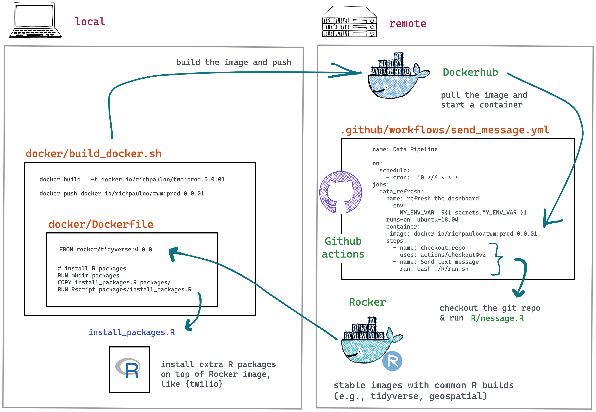
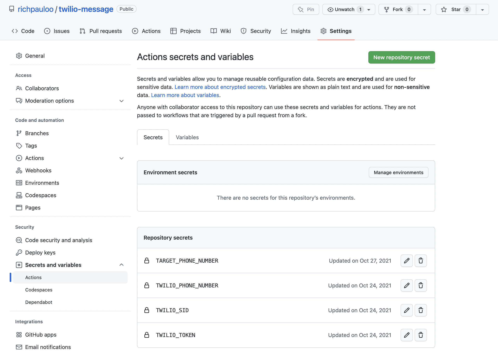
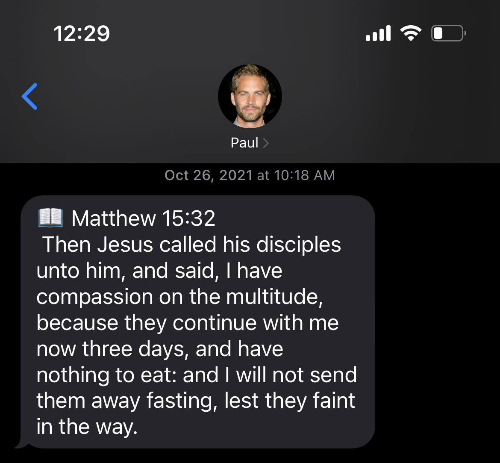
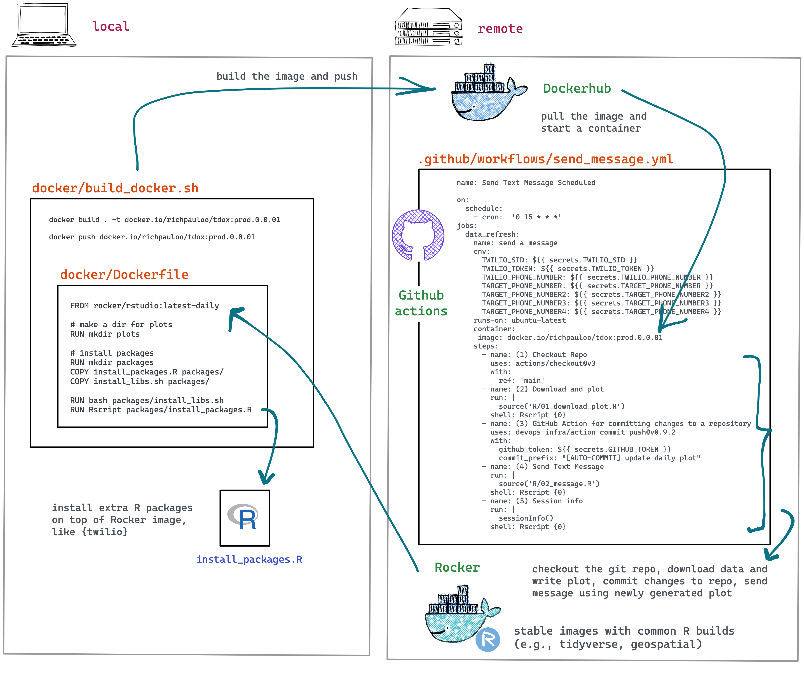
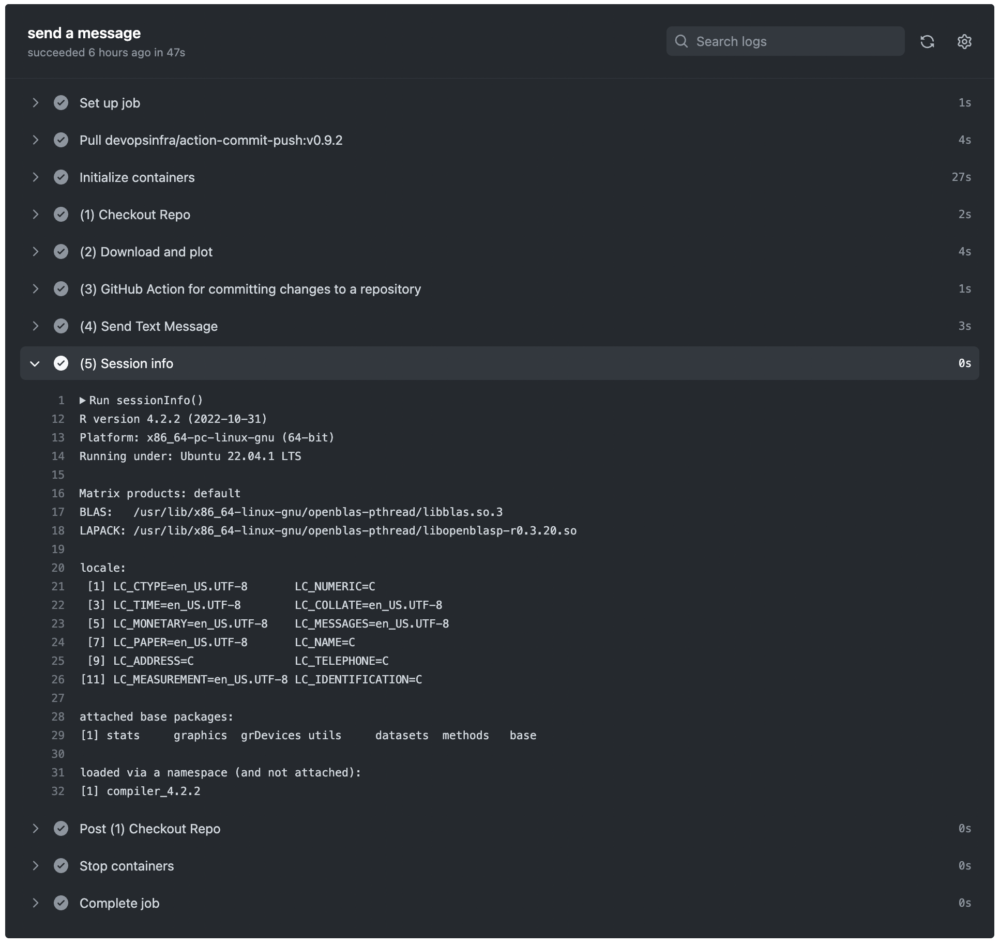
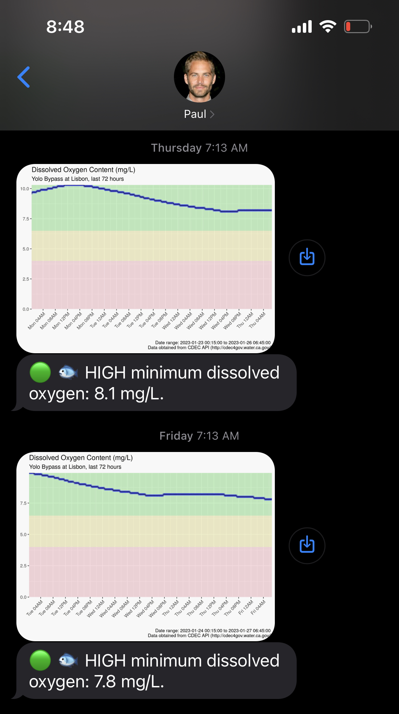

  
_Salvador Dali, "The Disintegration of The Persistence of Memory" 1952._

# Introduction

My mother grew up as the youngest of 6 children in Thailand, after her family emigrated from China during the Chinese Civil Wars. While growing up in Bangkok's Chinatown, my mother learned English from Christian missionaries, and eventually immigrated to the United States. 

First a devout Buddhist, and later a devout Christian, my mom's core values have always included love and compassion. I decided to find all bible verses that mention love or compassion, and create a bot that texts her a daily verse. In part 1 (SMS) of this post, I'll share how I accomplished this with R, Twilio, Docker, and Github Actions.

In part 2 (MMS), I'll expand the simple example to address a problem that recently came across my desk at the [Water Data Lab](https://www.waterdatalab.com): schedule a daily notification of the dissolved oxygen content of a stream to monitor ecosystem health so that a water resources manager can take preventative action when oxygen falls below 4 mg/L, at which point fish can rapidly die.  


## Part 1: SMS

Here we'll deploy a Docker container running R that sends an SMS (short message service, aka "text message") via the Twilio API, and orchestrate the code to run on a timer with Github Actions. To get a development environment setup in Docker, see this earlier blog post on [using RStudio with Docker](https://www.richpauloo.com/post/docker-rstudio/).  

Our workflow is captured in the diagram below. The best way to dig into this workflow is to inspect [the Github repo](https://github.com/richpauloo/twilio-message/actions/workflows/send_message.yml).   

  

We develop the code by pulling a base Docker image from the Rocker project (in the next example, we'll build this base image from scratch) and installing additional R packages (i.e., [{twilio}](https://github.com/seankross/twilio)). We develop locally by spinning up RStudio server within the Docker container and linking a volume which is the Github repository that we will deploy the Github Action from, to ensure the dev environment mimics the deploy environment. To see how to link a volume to a Docker container running RStudio, see [this earlier blog post](https://www.richpauloo.com/post/docker-rstudio/).

Our Dockerfile is:  

```docker
FROM rocker/tidyverse:4.0.0

# install packages
RUN mkdir packages
COPY install_packages.R packages/
RUN Rscript packages/install_packages.R
```

The `install_packages.R` file installs specific versions of `{twilio}` and `{here}` so we have firm and predictable dependencies:  

```r
devtools::install_version("twilio", version = "0.1.0", 
                          dependencies = "Depends", upgrade = "never")
devtools::install_version("here", version = "1.0.1", 
                          dependencies = "Depends", upgrade = "never")
```

We set the github workflow file `.github/workflows/send_message.yml` as:  

```yml
name: Send Text Message Scheduled

on:
  schedule:
    - cron:  '0 17 * * *'
jobs:
  data_refresh:
    name: send a message
    env:
      TWILIO_SID: ${{ secrets.TWILIO_SID }}
      TWILIO_TOKEN: ${{ secrets.TWILIO_TOKEN }}
      TWILIO_PHONE_NUMBER: ${{ secrets.TWILIO_PHONE_NUMBER }}
      TARGET_PHONE_NUMBER: ${{ secrets.TARGET_PHONE_NUMBER }}
    runs-on: ubuntu-18.04
    container:
     image: docker.io/richpauloo/twm:prod.0.0.01
    steps:
      - name: checkout_repo
        uses: actions/checkout@v2
      - name: Send text message
        run: bash ./R/run.sh  
```

This runs the workflow on a cron timer (`- cron:  '0 17 * * *'`). The `./R/run.sh` bash script simply calls `message.R` which takes some environmental variables (Twilio credentials, Twilio phone number and target phone number), which are accessed via the R session with `Sys.getenv('MY_ENV_VAR')`. To set environmental variables, in the Github repo navigate to _Settings -> Secrets and Variables -> Actions -> Repository Secrets_ (screenshot below).  

  

The `message.R` script is the main workhorse of the Github Action:  

```r
library(twilio)

# load environmental vars
tw_sid <- Sys.getenv("TWILIO_SID")
tw_tok <- Sys.getenv("TWILIO_TOKEN")
tw_phone_number  <- Sys.getenv("TWILIO_PHONE_NUMBER")
tw_target_number <- Sys.getenv("TARGET_PHONE_NUMBER")
deploy_date <- "2021-10-23"

# bible verses mentioning "love" or "compassion"
s <- read.csv(here::here("R/s.csv"))

# counter: number of days since deploy
i <- as.numeric(Sys.Date() - as.Date(deploy_date))

# randomly sample counter if it's out of range of the data
if(i > nrow(s)){
  i = sample(1:nrow(s), 1)
}

# configure auth
Sys.setenv(TWILIO_SID   = tw_sid)
Sys.setenv(TWILIO_TOKEN = tw_tok)

# send message
tw_send_message(from = tw_phone_number, 
                to   = tw_target_number,
                body = paste("\U0001f4d6", s$s[i]))

cat("Sent row number", i)
```

Note that it depends on a csv in the repo with 1304 rows, which I pre-generated by reading the entire bible into a dataframe and filtering on the regex `"love|compassion"` -- this extracts all verses that mention either "love" or "compassion". With one text daily, this workflow will send a unique verse to my mom for roughly 3.57 years before running out of verses, after which, it will randomly select a verse to send to my mom. Here's an example output that I sent to myself for testing purposes:  



My mom now receives one of these every day! For fans of the _Fast and Furious_ movie franchise, I have indeed saved my Twilio account's phone number as the late Paul Walker (Rest in Peace, Paul).  


## Part 2: MMS

Twilio is great for text messages (SMS), but we can also use Twilio to send MMS (multimedia message service, aka "photos, files, video, emoji, link"). To do so, we simply attach an image web url. Let's demo that now. 

In particular, let's _create_ a custom image with ggplot based on API data that's continuously updated so that we have a daily notification service. We will pull data from the API, write a plot, commit that to the repo, and then text the plot to a phone number once daily. You can inspect the [fully functional Github repository here](https://github.com/richpauloo/twilio_dox/actions).   

The architecture in this example is slightly more complex because we build a custom Docker image from a relatively stripped down `rocker/rstudio:latest-daily` base image, and because the Github Actions now contain a few more steps: ping an API, create and save a plot and csv, commit that plot and csv to the repo, send a message with summary stats from the csv and the saved plot to some phone numbers, and print the `sessionInfo()`.  

  

First, we build our custom Docker image. I didn't need all of the dependencies of `rocker/tidyverse`, but I did want to [develop in RStudio in Docker](https://www.richpauloo.com/post/rstudio-docker/) so I began with the relatively spartan `rocker/rstudio:latest-daily` base image. Starting from the Rocker Dockerfiles and tracing these back to the bash install scripts ([for example](https://github.com/rocker-org/rocker-versioned2/blob/master/scripts/install_verse.sh)) is a great way to gain intuition and start building an image from scratch ([I modified this script here to include only what I needed -- this helps control the image size and build time, and eliminates unneeded dependencies](https://github.com/richpauloo/twilio_dox/blob/main/docker/install_libs.sh)).  


If building Docker images on the Apple M1, chip, use the cross-platform `buildx` ([detailed here](https://docs.docker.com/build/building/multi-platform/)), like so:   

```docker
docker buildx build \
    --platform=linux/amd64 \
    . \
    -t docker.io/richpauloo/tdox:prod.0.0.01
```


Next, the github workflow file `.github/workflows/send_message.yml` is:  

```yml
name: Send Text Message Scheduled

on:
  schedule:
    - cron:  '0 15 * * *'
jobs:
  data_refresh:
    name: send a message
    env:
      TWILIO_SID: ${{ secrets.TWILIO_SID }}
      TWILIO_TOKEN: ${{ secrets.TWILIO_TOKEN }}
      TWILIO_PHONE_NUMBER: ${{ secrets.TWILIO_PHONE_NUMBER }}
      TARGET_PHONE_NUMBER: ${{ secrets.TARGET_PHONE_NUMBER }}
    runs-on: ubuntu-latest
    container:
     image: docker.io/richpauloo/tdox:prod.0.0.01
    steps:
      - name: (1) Checkout Repo
        uses: actions/checkout@v3
        with:
          ref: 'main'
      - name: (2) Download and plot
        run: |
          source('R/01_download_plot.R')
        shell: Rscript {0} 
      - name: (3) GitHub Action for committing changes to a repository
        uses: devops-infra/action-commit-push@v0.9.2
        with:
          github_token: ${{ secrets.GITHUB_TOKEN }}
          commit_prefix: "[AUTO-COMMIT] update daily plot"
      - name: (4) Send Text Message
        run: |
          source('R/02_message.R')
        shell: Rscript {0} 
      - name: (5) Session info
        run: |
          sessionInfo()
        shell: Rscript {0} 
```

Notice that you can pass R code directly into the `run:` part of a workflow step by specifying the `shell: Rscript {0}`. Similarly, you can pass bash and specify `shell: bash`.  


Also note that the final task in this workflow prints the `sessionInfo()` to the workflow log, which is helpful for debugging (example output below).  

  


Next, the `01_download_plot.R` step downloads data from a United States Geologic Survey IoT sensor that measures dissolved oxygen in the surface water body that we wish to monitor, then writes a plot and csv.  

```r
library(rvest)
library(ggplot2)
library(lubridate)
library(dplyr)

# tomorrow's date for the API query
today <- Sys.Date() + 1
cat("Running query for", today, "and 72 hrs prior.\n")

# url prefix and suffix - works for this simple, single endpoint use case
# hard codes the sensor number (61) and duration (96 hrs)
prefix <- "http://cdec4gov.water.ca.gov/dynamicapp/selectQuery?Stations=LIS&SensorNums=61&dur_code=E&End="
suffix <- "&span=96hours"

# URL query to pass to CDEC
url <- paste(prefix, today, suffix, sep = "")

# read the query, unlist the output and clean:
# rename cols, convert t to datetime, filter blank (future) DO
df <- read_html(url) %>% 
  html_elements("tbody") %>% 
  html_table() %>% 
  .[[1]] %>% 
  select(1:2) %>% 
  setNames(c("t", "do")) %>% 
  filter(do != "--") %>% 
  mutate(t = mdy_hm(t), do = as.numeric(do)) 
cat("Downloaded", nrow(df), "rows of data.\n")

# stash data for summary stats in 02_message.R
unlink("csv", recursive = TRUE)
dir.create("csv")
write.csv(df, paste0("csv/", Sys.Date(), ".csv"))
cat("Wrote csv.\n")

# caption for ggplot
caption <- paste(
  "Date range:", paste(range(df$t), collapse = " to "), 
  "\n", "Data obtained from CDEC API (http://cdec4gov.water.ca.gov/)"
)

# plot and save to GH path, then commit changes
p <- ggplot() +
  geom_rect(
    data = data.frame(x1 = min(df$t), x2 = max(df$t), 
                      y1 = 0, y2 = 4),
    aes(xmin = x1, xmax = x2, ymin = y1, ymax = y2), 
    fill = "pink", alpha = 0.5
  ) +
  geom_rect(
    data = data.frame(x1 = min(df$t), x2 = max(df$t), 
                      y1 = 4, y2 = 6.5),
    aes(xmin = x1, xmax = x2, ymin = y1, ymax = y2), 
    fill = "#F1EB9C", alpha = 0.5
  ) +
  geom_rect(
    data = data.frame(x1 = min(df$t), x2 = max(df$t), 
                      y1 = 6.5, y2 = max(df$do, na.rm = TRUE)),
    aes(xmin = x1, xmax = x2, ymin = y1, ymax = y2), 
    fill = "#90EE90", alpha = 0.5
  ) +
  geom_point(
    data = df, aes(t, do),
    alpha = 0.3, color = "blue"
    ) + 
  geom_line(
    data = df, aes(t, do),
    alpha = 0.7
  ) +
  scale_x_datetime(date_breaks = "4 hours", date_labels = "%a %I%p") +
  labs(
    title    = "Dissolved Oxygen Content (mg/L)",
    subtitle = "Yolo Bypass at Lisbon, last 72 hours",
    caption  = caption,
    x = "", y = ""
  ) +
  coord_cartesian(expand = 0) +
  theme(axis.text.x = element_text(angle = 45, hjust = 1)) 
p
path_out <- paste0("png/", Sys.Date(), ".png")
ggsave(path_out, p, height = 5, width = 7)
cat("Saved plot to", path_out, "\n")
```

Next, the [`devops-infra/action-commit-push@v0.9.2`](https://github.com/marketplace/actions/github-action-for-committing-changes-to-a-repository) step commits the changes just made (written csv and plot) to the github directory. There is an entire [Marketplace of Github Actions for standard tasks like this](https://github.com/marketplace?type=actions) that you don't need to re-invent, and can instead pull with a single line of code.  

Then, we send the text message with `02_message.R`:  

```r
library(twilio)

# load environmental vars
tw_sid            <- Sys.getenv("TWILIO_SID")
tw_tok            <- Sys.getenv("TWILIO_TOKEN")
tw_phone_number   <- Sys.getenv("TWILIO_PHONE_NUMBER")
tw_target_number  <- Sys.getenv("TARGET_PHONE_NUMBER")

# PNG plot img url from github 
url_img <- paste0(
  "https://raw.githubusercontent.com/richpauloo/twilio_dox/main/png/",
  Sys.Date(),
  ".png"
)

# read stashed df
df <- read.csv(paste0("csv/", Sys.Date(), ".csv"))

# minimum dissovled oxygen (mg/L)
min_do <- min(df$do, na.rm = TRUE)

# determine high/med/low message and construct text 
msg_high <- paste(
  "\U0001F7E2 \U0001F41F HIGH minimum dissolved oxygen:",
  min_do, "mg/L."
)

msg_medium <- paste(
  "\U0001F7E1 \U0001F41F MEDIUM minimum dissolved oxygen:",
  min_do, "mg/L."
)

msg_low <- paste(
  "\U0001F534 \U0001F41F LOW minimum dissolved oxygen:",
  min_do, "mg/L."
)

if(min_do >= 6.5) {
  msg = msg_high
} 
if(min_do < 6.5 & min_do >= 4) {
  msg = msg_medium
} 
if(min_do < 4) {
  msg = msg_low
} 

# text the plot to the target phone numbers 
tw_send_message(
  from      = tw_phone_number, 
  to        = tw_target_number,
  body      = msg,
  media_url = url_img
)

cat("Sent plot via text message\n")
```

The final result is the daily MMS that shows the last 72 hours of dissolved oxygen content in the stream. Two successive days are shown. Green, yellow, and red ranges show dissolved oxygen regions that correspond to high, medium, and low water quality. Finally, the minimum dissolved oxygen in mg/L over the prior 72 hour range is calculated and reported.  




# Conclusion

We've seen how to send SMS and MMS with R and Twilio, and how to deploy that code within a Docker container running on Github Actions. Together, these tools comprise a lightweight monitoring and alert system. Setting up a development environment with RStudio Server and Docker is covered in [this previous blog post](https://www.richpauloo.com/post/docker-rstudio/). 
