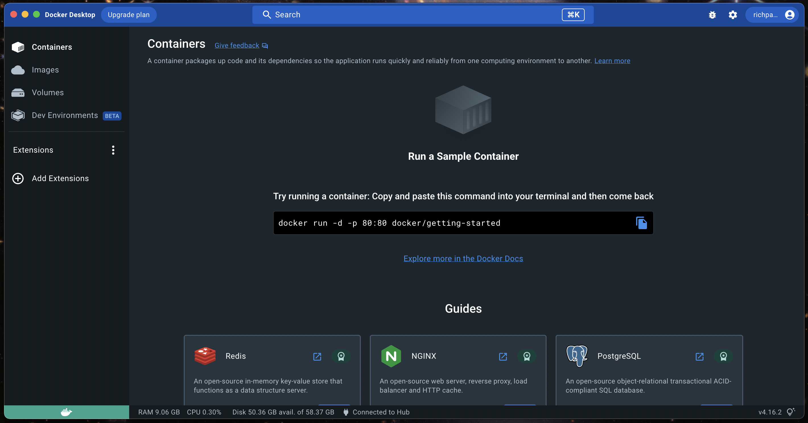
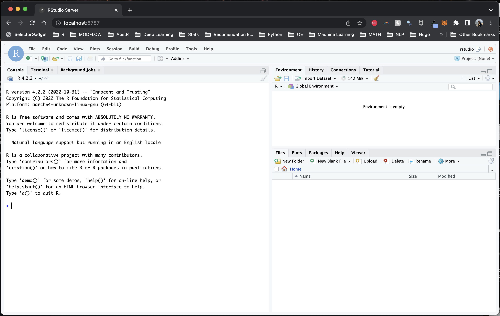
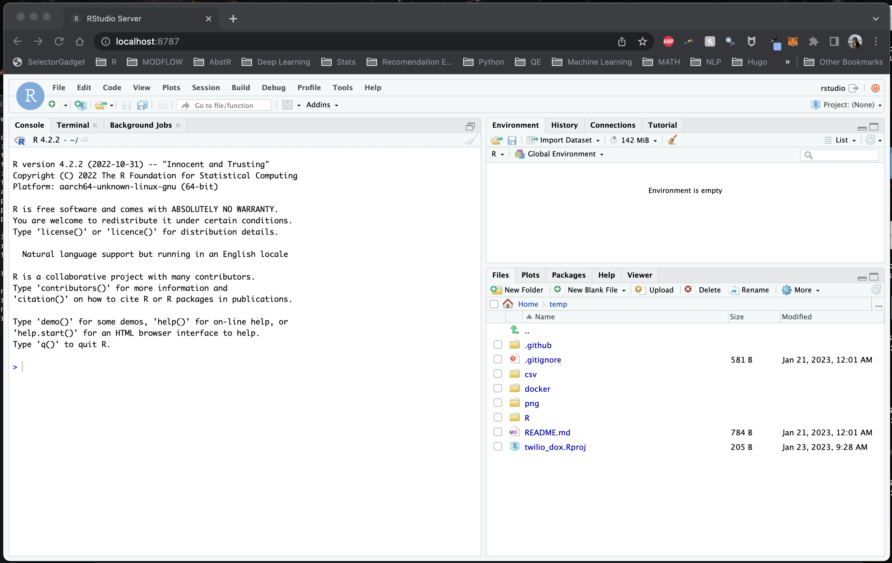

  
_Salvador Dali, "The Persistence of Memory" 1931._


# Introduction

Although Docker has been around for years, Docker in the data science community doesn't seem as widespread as git, which I attribute to the fact that many data scientists learn to program and work independently. However, as data scientists increasingly collaborate with others or aim to make their work more reproducible, Docker deserves an equal place alongside git in the practitioner's toolkit. Docker's ability to containerize applications and dependencies makes it easy to share, reproduce, and scale work, while also ensuring consistency across different environments.  

The motivation of this blog post is to demonstrate how Docker can help streamline your data science projects and make your team more productive. To illustrate, I'll use R + RStudio as a language and IDE combo, but want to note that this is just as easily accomplished with Python/Julia + VSCode/JupyterLab, or another combo of language and IDE.  

First, some definitions:  

- `Docker`: software that uses a **Dockerfile** to build a Docker **image** and run a Docker **container**  
- `Dockerfile`: a plain text file with instructions for building a Docker image  
- `Docker image`: a computing environment which can be pushed to a repository, and pulled to run a Docker container  
- `Docker container`: a running instance of a Docker image that can evaluate code  


## Why Docker for data science teams?

Let's break this into two questions: (1) why Docker for data science, and (2) why Docker for data science _teams_?

### (1) Docker for data science

Simply put: **Docker** is to **environments** as **git** is to **code**. If git offers version control, Docker offers environment control.  

Docker allows us to extend reproducibility beyond our code down to the operating system, dependencies, and packages that our code runs on.  


### (2) Docker for data science teams

Although there are plenty of PhD students and independent researchers toiling away on their own local machines (I know because I've been there before), one day, your lonely data science project may become a team sport, and at that time, you'll need to share code across environments. And that will likely expose technical debt you didn't even know you had, and break your code in new and marvelous ways. And you may be filled with regret.   

Now imagine that your data science project has grown to a team of 10 data scientists, and you need to rapidly onboard new teammates. What's the plan to seamlessly set up new teammates for success? Is it `pip install -r requirements.txt` (Python) or `renv::restore()` (R)? These solutions are commonplace, but also inadequate because they only address packages, not operating systems and the system level software that build these packages.  

Now image that you need to develop and deploy code in some production environment. Docker allows us to mirror that production environment if we know how it was built. Or, we can deliver code in a Docker container that it's guaranteed to evaluate in.  

With Docker, teams can operate in the same environment, share that environment with a single line of code, and modify and rebuild that environment as requirements change. Onboarding a new teammate into that environment is as simple as pulling the team's Docker image and attaching a local volume (more on this later).  

Some might say, isn't this just like a data science workbench like JupyerHub, RStudio Connect, or Databricks? Yes and no. Cloud workbenches offer much more than environment control and tend to be _expensive_. What I'm describing here is a workflow with Docker that's perfect for teams on a budget. A private Dockerhub repo is $5/month per user.  

Now, let's see how a Docker workflow might look.  


## Case Study A: RStudio in your pocket

First, download, install, and open [Docker Desktop](https://www.docker.com/products/docker-desktop/).  

  

With Docker Desktop open, next, open a terminal and verify that Docker is installed with `docker --version`. Then, pull the latest pre-built image from the [Rocker project](https://rocker-project.org/), which maintains a collection of images[^1] that run R and RStudio Server by running the following:  

[^1]: Browsing the Rocker [image collection](https://rocker-project.org/images/) is worth a moment of your time.  

```docker
docker run \
    --rm \
    -ti \
    -p 8787:8787 \
    -e DISABLE_AUTH=true \
    rocker/rstudio:latest-daily
```

This silently starts RStudio Server. To access, open a browser and navigate to `localhost:8787` and you should see RStudio Server.  

  

Before we move on, let's explain the code above. First, you're pulling the `rocker/rstudio:latest-daily` image[^2] and running (`run`) it in a container on port 8787 (`-p 8787`) with the environmental variable `-e DISABLE_AUTH=true`[^3] so you don't need to supply a username and password on login. The `-ti` option is short for `--tty --interactive` which specifies that the container should be run in the terminal and the input should be accepted from the terminal, which allows us to interact with the container (through RStudio, in this case). You're also removing `--rm` the container once it's finished running instead of stashing it on your computer (this can take up a lot of space over time).  

[^2]: Docker will first look locally for a supplied image, and if it's not found, it then searches for it online, and stashes it locally. This is to speed up future docker runs with cached images.  

[^3]: This is sometimes run with a password, where we swap `DISABLE_AUTH=true` with `PASSWORD=mypassword`. When doing this, the username is `rstudio` and the password is what you input. I prefer to run this without auth to go straight to RStudio Server, but your organization may have certain restrictions around this depending on network config.  

Let that sink in for a moment. Given a computer with Docker, all you need to do is pull an image and open an IDE in a browser.  

The idea is more powerful once you build an image useful for the kind of data science you do -- that might be geospatial libraries, interactive data visualization and reporting, Bayesian stats, machine learning, or something else. The idea behind pre-built [Rocker images](https://rocker-project.org/images/) is to automate some of this time-consuming image-building. Just pull a pre-built image off the shelf and get to work. Rocker has plenty of options (although at the time of writing 2023-01-28, only the `rstudio:latest-daily` image plays well with the new Apple M1 chip when it comes to running RStudio Server).  

## Linking a volume

A blank RStudio is not as useful as one that you can bring local files into, and moreso, what if you want to _create_ and save something in that Docker container, like a plot or a script? How do you move that outside of the container?  

Answer: mount a **volume** (`-v`) to the container like so:

```docker
docker run \
    --rm \
    -ti \
    -p 8787:8787 \
    -v /Users/richpauloo/Documents/Github/twilio_dox:/home/rstudio/temp \
    -e DISABLE_AUTH=true \
    rocker/rstudio:latest-daily
```



Here I'm mounting the directory from the host machine `/Users/richpauloo/Documents/Github/twilio_dox` to the `/home/rstudio/temp` directory in the container. Now when I fire up the container, I have access to the mounted volume (in this case, a Github subdirectory on my local machine). Once a volume is mounted to a container, it can be accessed and modified by processes running inside the container as if it were a normal directory. Changes to files in the volume persist after the container is shut down. Thus, we can write scripts, modify data, write files, and retain all of this after the volume shuts down.  

We might also use a volume to store sensitive data (think env vars, credentials, config files) that we don't want to store in the container. Or we might use volumes to share data between containers.  


## Case Study B: Orchestration, e.g. - with Github Actions

A major benefit of developing and packaging code into a container is passing this code and container combo to an orchestration framework like Github Actions. I won't go into this much further, because there is a follow on [blog post on exactly the topic of using Github Actions to send daily SMS and MMS messages via the Twilio API](https://www.richpauloo.com/post/docker-github-actions/).  


# Conclusion

Docker is to environments and operating systems what git is to version control. Portable, shareable, fault-tolerant data science environments are possible with R, RStudio, and Docker. You can capture your data science environment as an image and share that image with teammates, to a wider audience who may want to reproduce your work, or with yourself when you're called to maintain code you wrote years ago.   
