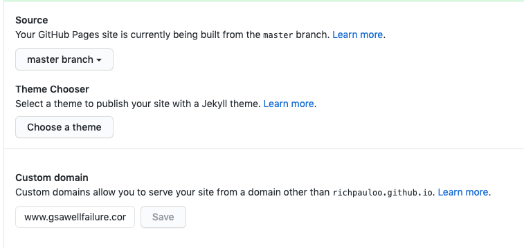
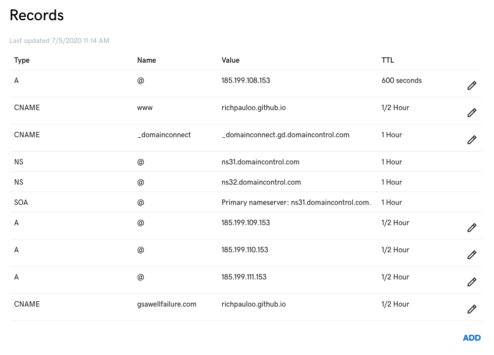
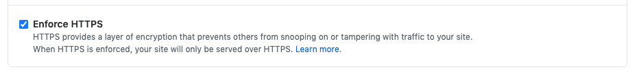

  
_John Martin, "Destruction of Pompeii and Herculaneum" 1821_  

Whenever I host a Jekyll site on GH pages, I usually spend an extra hour or two on tiny details that I want to record in this post, which is a boilied down set of instructions to add a custom domain (e.g., www.mydomain.com) to a Github Pages site that may be either your default github site (`username.github.io`), or a project page in another repo `username.github.io/my-project`. 


# Step 1

Start with a boilerplate Jekyll theme to host your site or project page ([here's a recent one at the time of writing](https://github.com/daviddarnes/alembic)). Change the contents of the `CNAME` file to `www.mydomain.com` 

Next, in the Github repo **Settings**, add your custom domain into the "Custom domain" box, ensuring that it's preceeded by the `www` subdomain:  

  

Make sure you do Step 1 before Step 2, for security reasons outlined in the [Github docs](https://help.github.com/en/github/working-with-github-pages/managing-a-custom-domain-for-your-github-pages-site#about-custom-domain-configuration).  

# Step 2

In your DNS Management console, delete any `CNAME` record that points `www` to `@`, and add a `CNAME` record with the following parameters:  

```bash
type  = CNAME
name  = www
value = username.github.io.
```



**Meaning:** This tells your DNS to point www.mydomain.com requests towards the site hosted at username.github.io. Set the TTL (time to live) to an hour or less.  

Next add 4 separate `A` records with the following information:  

```bash
type  = A  
name  = @  
value = IP   
```  



For IPs, use the Github IP addresses that host your username.github.io site. As of writing (2019-11-15) these IPs are: 

```r
185.199.108.153
185.199.109.153
185.199.110.153
185.199.111.153
```

The values might have changed since the time of writing. See the [offical docs](https://help.github.com/en/github/working-with-github-pages/managing-a-custom-domain-for-your-github-pages-site#about-custom-domain-configuration) for the most up-to-date values.  

**Meaning:** `A` records connect the custom domain (hosted by your DNS) to the actual IP addresses where your site lives on a Github server. 

# Step 3

Back in the Github repo settings, do hard reset, and click "Enforce HTTPS":



Navigate to mydomain.com to see your github page! Be patient if it doesn't immediately show due to [DNS propogration](https://www.namecheap.com/support/knowledgebase/article.aspx/9622/10/dns-propagation--explained). 


***  


Here are three resources I found helpful while doing this:

1. [Offical docs](https://help.github.com/en/github/working-with-github-pages/managing-a-custom-domain-for-your-github-pages-site#about-custom-domain-configuration)
2. [An unoffical guide](https://medium.com/@hossainkhan/using-custom-domain-for-github-pages-86b303d3918a).  
3. [Nice explanation of A records](https://www.godaddy.com/help/add-an-a-record-19238)
4. [Stack overflow guide](https://stackoverflow.com/questions/9082499/custom-domain-for-github-project-pages)  
5. [helpful blog](https://medium.com/@monarchwadia/github-pages-setting-up-www-subdomain-with-ssl-https-aca9eca371d6)
