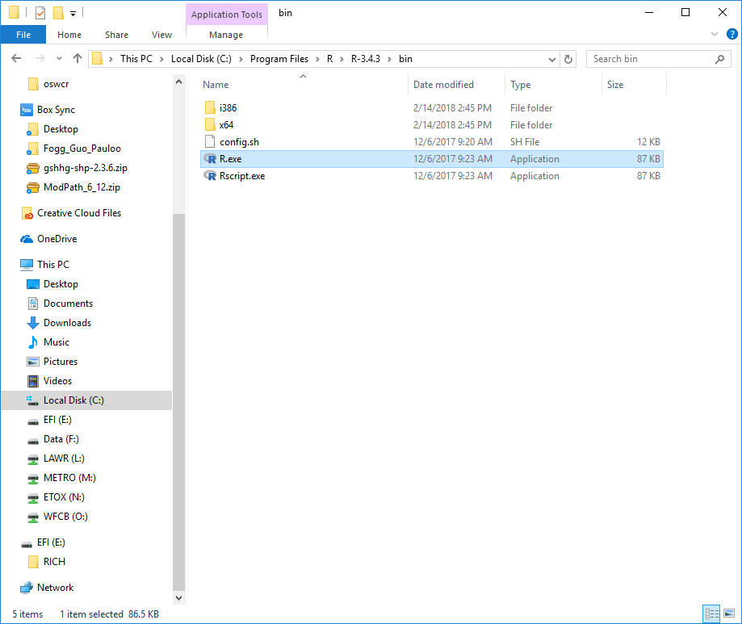
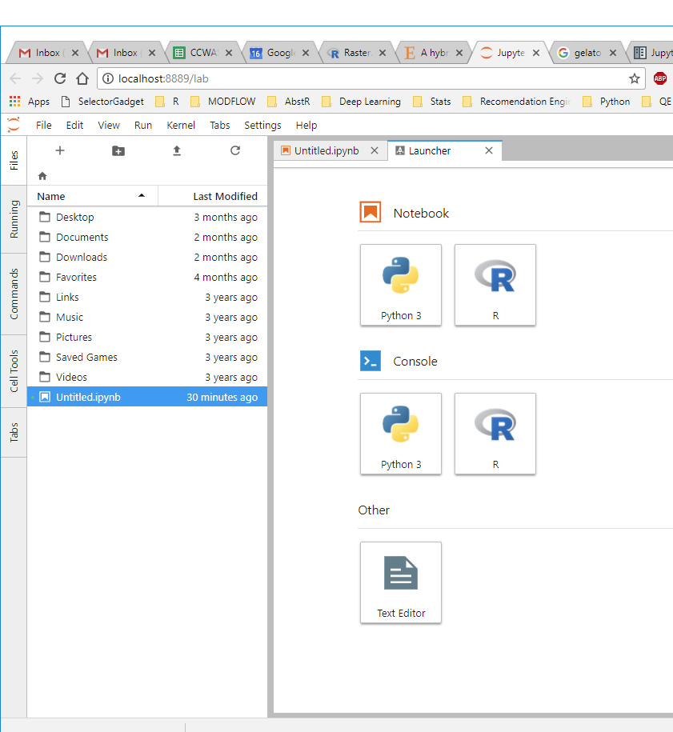

I was recently pretty impressed with [Jupyter's](http://jupyter.org/) newest creation, the Jupyter Lab IDE. You can test drive an online demostration of Jupyter Lab with a Python and R kernel [here](https://mybinder.org/v2/gh/jupyterlab/jupyterlab-demo/18a9793b58ba86660b5ab964e1aeaf7324d667c8?urlpath=lab%2Ftree%2Fdemo%2FLorenz.ipynb).  

I downloaded a version, and found that the R Kernel was missing! To get the R kernel up and running in Jupyter Lab was a bit more complicated than expected. This guide is meant to break things down step by step.   

I did this on Windows and OSX.  


# Windows Instructions


## 1. Install Anaconda 

Download [here](https://www.anaconda.com/download/). This gives you a few important things: Jupyter notebooks, and the Anaconda Prompt.  


## 2. Install the Jupyter client 

Search for the Anaconda Prompt in your computer, **right click, and run As Adminstrator**.  


In the prompt type:

```python
conda install -c anaconda jupyter_client
```  


## 3. Install the IR Kernel 

I assume you have R on your computer. If not, I recommend downloading it [here](https://cloud.r-project.org/).  

Find the location of `R.exe` on your computer. In my computer this executable is at: `C:\Program Files\R\R-3.4.3\bin`.  

  


Open another Anaconda Prompt as Adminstrator and change directories to wherever `R.exe` is on your computer with `cd file path`. On my computer it's: `cd C:\Program Files\R\R-3.4.3\bin`, but it might be different for you.  

Then run R from within Anaconda Prompt in Admin mode with `R.exe`.  

Once in an R session, run the following three commands:


```r 
install.packages("devtools")
devtools::install_github("IRkernel/IRkernel")
IRkernel::installspec()
```  

In order, they (1) install the devtools package which gets you the `install_github()` function, (2) install the IR Kernel from github, and (3) tell Jupyter where to find the IR Kernel.  


## 4. Open Jupyter Lab and enjoy your new R kernel!  

Open Anaconda Prompt and type in `jupyter lab`. Jupyter Lab should launch and display both a python and R kernel.  

  


# OSX  Instructions


I found installation on my Mac a lot easier. I just followed the steps [here](https://irkernel.github.io/installation/).  

## 1. Install Anaconda

Download the Mac version [here](https://www.anaconda.com/download/#macos) and run through the setup.  


## 2. Open R and install the necessary packages

Open up the R prompt and enter:  

```r
install.packages(c('repr', 'IRdisplay', 'evaluate', 'crayon', 'pbdZMQ', 'devtools', 'uuid', 'digest'))
devtools::install_github('IRkernel/IRkernel')
```  


## 3. Configure IRkernel from within R

It's important that these next commands are done from within the version of R that you want to link to Jupyter Lab.  

I found my version of R in `richpauloo$ /Library/Frameworks/R.framework/Versions/3.4/Resources/bin/R`. Navigate to the version of R you're using, lanuch `R.exe`, and enter:  


```r
IRkernel::installspec() # install for the current user
IRkernel::installspec(user = FALSE) # install system-wide
```  

Fire up Anaconda, launch a Jupyter Lab session, and you should see an R kernel waiting for you!  


***  

Lastly, I found the [Jupyter Lab User's Guide](https://jupyterlab.readthedocs.io/en/stable/) to be pretty helpful, and you might too. 
