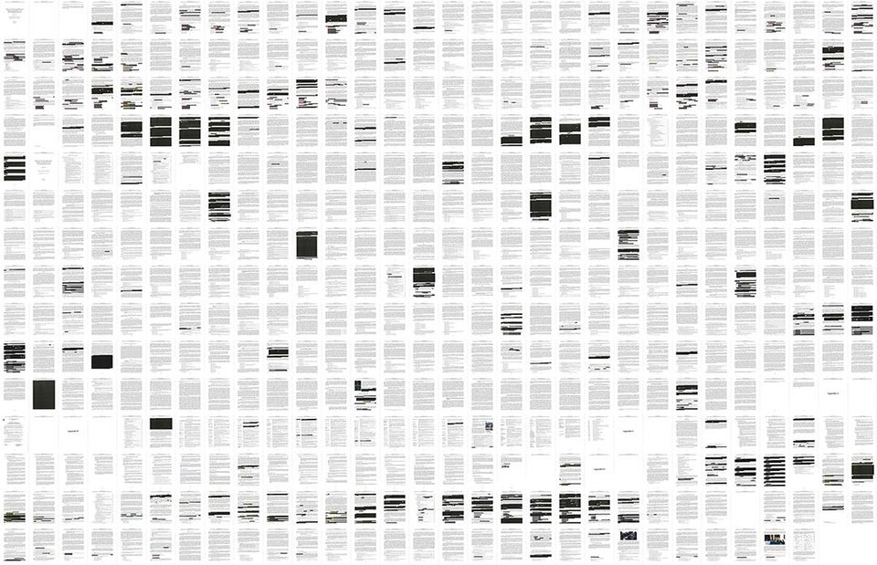

  
_All 448 pages of the redacted report, with redacted setions shown in black. Source: [LA Times](https://www.latimes.com/projects/la-na-mueller-investigation-report-trump-redaction/#nt=oft-Double%20Chain~Flex%20Feature~~document-841a~~1~yes-art~curated~curatedpage)_  


After years of investigation, the Department of Justice released [a redacted copy of the Mueller Report](https://www.cnn.com/2019/04/18/politics/full-mueller-report-pdf/index.html) on Thursday April 18, 2019. The report weighs in at a hefty 448 pages, and covers everything from Russian interference in 2016 presidential election, to the private testimony of Michael Cohen, and whether or not President Trump may have obstructed justice.    

I don't have all day to read this report, but I am interested to see what I can learn in a short afternoon by scraping the report and doing a cursory text and sentiment analysis.  

I'm going to rely on two main packages: [`pdftools`](https://github.com/ropensci/pdftools) for scraping the text of the report, and [`tidytext`](https://www.tidytextmining.com/) for general text mining functions.  

```{r, warning=FALSE, message=FALSE, error=FALSE}
library(pdftools)
library(tidytext)
library(dplyr)
library(stringr)
library(tidyr)
library(ggplot2)
library(reshape2)
library(wordcloud)
```


First, let's grab the raw text from the file, and replace line break characters `\r\n` with spaces.  
```{r}
d <- pdf_text("~/Documents/Github/junkyard/mueller/report.pdf")
d <- str_replace_all(d, "\r\n", " ")
```

Each page is an element in the vector `d`, so we can easily access any page by indexing it.
```{r}
cat(d[1])   # page 1: the title
cat(d[300]) # page 300
```

Let's do some light cleaning and formatting: tokenize all words, index the postion of each word within its page and the document overall, remove stop words, and remove numeric tokens.  
```{r, message=FALSE}
text_df <- tibble(page = 1:length(d), text = d)

df <- text_df %>%
  unnest_tokens(word, text) %>% 
  group_by(page) %>% 
  mutate(page_ind = row_number(page),
         page_length = length(page)) %>% 
  ungroup() %>% 
  mutate(pos_page = page_ind/page_length,
         doc_ind  = 1:nrow(.),
         pos_doc  = doc_ind/nrow(.)) %>% 
  anti_join(stop_words) %>% 
  filter(!str_detect(word, "[:digit:]"))
```

Now, I join sentiment scores (either positive or negative) for every word in the doc, using the sentiment lexicon from [Bing Liu and collaborators](https://www.cs.uic.edu/~liub/FBS/sentiment-analysis.html), calculate the number of positive and negative words on each page, and normalize this score across the document. I had to remove the string "trump" because it's used so much in the document, and actually classifies as a positive word, which is misleading. As expected given the nature of the investigation, the Mueller report is a pretty negative document.  

```{r, message=FALSE} 
p <- df %>%
  inner_join(get_sentiments("bing")) %>% 
  filter(word != "trump") %>% 
  count(page, sentiment) %>% 
  spread(sentiment, n, fill = 0) %>%
  mutate(sentiment = positive - negative,
         sentiment = sentiment/max(abs(sentiment)),
         dir       = ifelse(sentiment >=0, "up","dn")) 

p %>% 
  ggplot(aes(page, sentiment, fill = dir)) +
  geom_col() +
  labs(title    = "The Mueller Report is generally negative",
       subtitle = "Relative sentiment per page",
       x = "Page number", 
       y = "Normalized sentiment") +
  coord_cartesian(ylim = c(1,-1)) +
  theme_minimal() +
  theme(legend.position='none') 
```

We can see what's going on in the most negative and positive pages like so.  

Ironically, according to the words themselves, the most "positive" page of the report (247) concerns former FBI director James Comey's private dinner with Trump, where Trump allegedly requested him to pledge loyalty to him. This old story was covered in everything from the [Times](https://www.nytimes.com/2017/05/11/us/politics/trump-comey-firing.html) to the [Washington Post](https://www.washingtonpost.com/world/national-security/i-expect-loyalty-trump-told-comey-according-to-written-testimony/2017/06/07/46413298-4bab-11e7-a186-60c031eab644_story.html?noredirect=on&utm_term=.4e49db8040fc) and [Economist](https://www.economist.com/united-states/2017/06/08/evidence-from-a-former-fbi-boss).  

```{r}
top <- p %>% top_n(1,  wt = sentiment) %>% pull(page)
bot <- p %>% top_n(-1, wt = sentiment) %>% pull(page)

cat(d[top])
```

The most "negative page" of the document (378) addresses legal definitions of collusion, obstruction, and so on. With sentences the following, it's easy to see why this page scores high on negative sentiment.  

> "[a]s used in [S]ection 1505, the term 'corruptly' means acting with an improper purpose,  personally or by influencing another, including by making a false or misleading statement, or withholding,  concealing, altering, or destroying a document or other information.  

```{r}
cat(d[bot])
```


We can take a closer look at the words that contribute towards positive and negative scores.  
```{r, message=FALSE}
bing_word_counts <- df %>%
  inner_join(get_sentiments("bing")) %>%
  filter(word != "trump") %>% 
  count(word, sentiment, sort = TRUE) %>%
  ungroup()

bing_word_counts %>%
  group_by(sentiment) %>%
  top_n(10) %>%
  ungroup() %>%
  mutate(word = reorder(word, n)) %>%
  ggplot(aes(word, n, fill = sentiment)) +
  geom_col(show.legend = FALSE) +
  facet_wrap(~sentiment, scales = "free_y") +
  labs(y = "Contribution to sentiment",
       x = NULL) +
  coord_flip() +
  theme_minimal()
```

And view the top 100 words in the document, colored by sentiment. 

```{r, message=FALSE}
df %>%
  inner_join(get_sentiments("bing")) %>%
  filter(word != "trump") %>% 
  count(word, sentiment, sort = TRUE) %>%
  acast(word ~ sentiment, value.var = "n", fill = 0) %>%
  comparison.cloud(colors = c("red", "lightblue"),
                   max.words = 100)
```


That's all that quick and dirty analysis will allow. Enjoy reading the full version of the report in your copious free time!  


