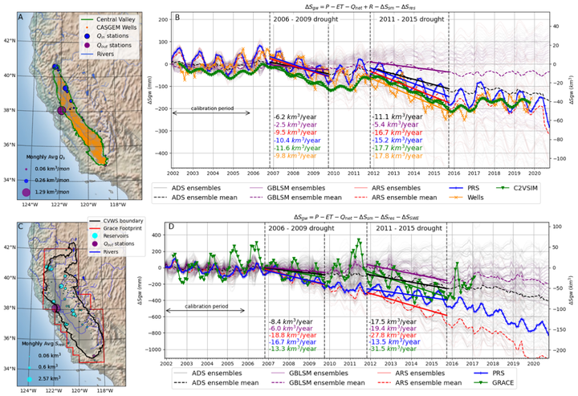
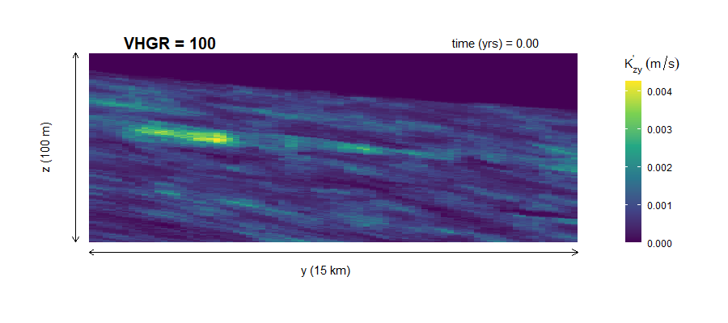
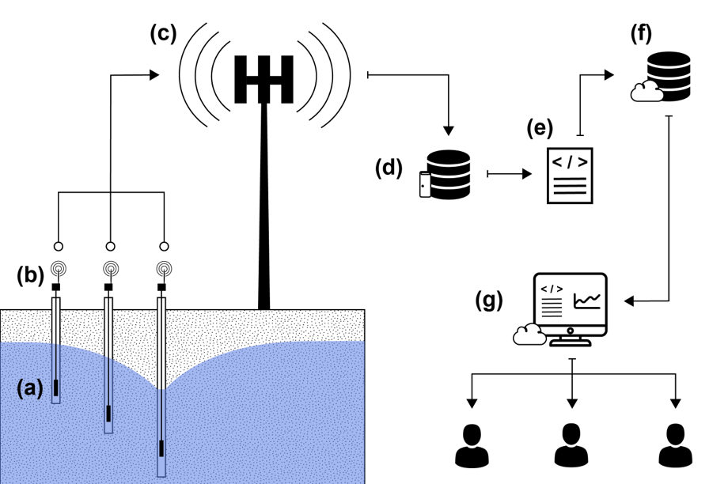
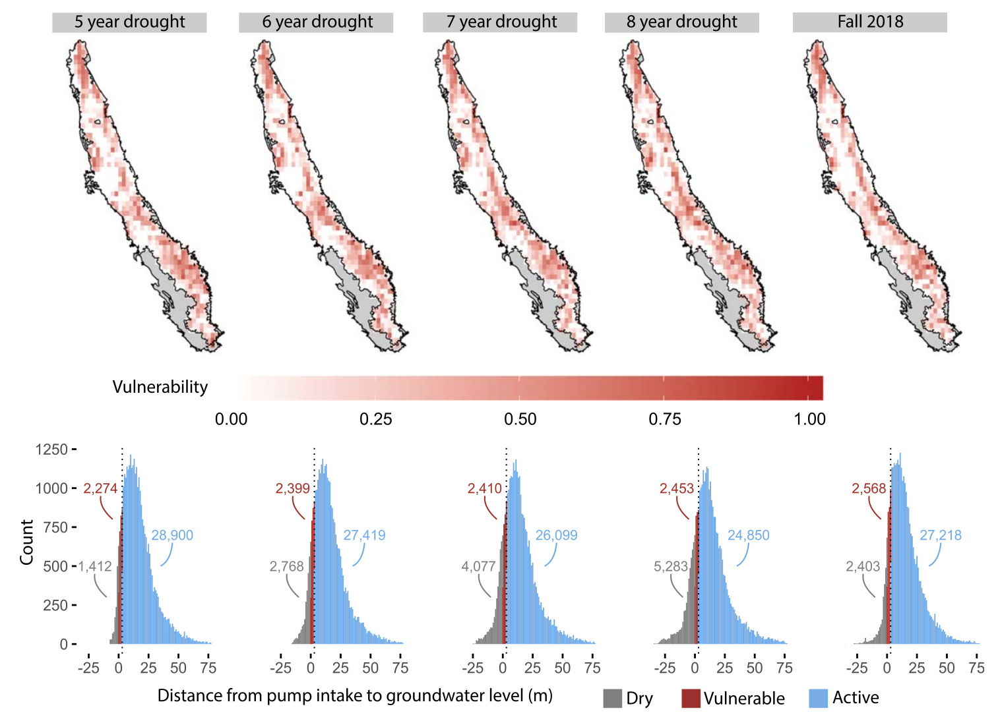

***  

Darcy Bostic, Linda Mendez-Barrientos, **Rich Pauloo**, Kristin Dobbin, Victoria MacClements  (2023). _Thousands of domestic and public supply wells face failure despite groundwater sustainability reform in California’s Central Valley_. Nature Scientific Reports.  
- [Paper](https://www.nature.com/articles/s41598-023-41379-9)  
- [LA Times article](https://www.latimes.com/environment/story/2023-09-20/thousands-of-central-valley-water-wells-risk-failure)  

***  

María G. Castrellón, **Rich Pauloo**, Ioana Popescu, José Fábrega (2023). _ONASP: A web application for groundwater data visualization in Panama_. 14th International Conference on Hydroinformatics.  
- [Paper](https://iopscience.iop.org/article/10.1088/1755-1315/1136/1/012028)  
- [Website](https://mgcastre.shinyapps.io/ONASP/)  

*** 

Zhilin Guo, Graham E. Fogg, **Rich Pauloo**, Chunmiao Zheng (2022). _Sustainability of Regional Groundwater Quality in Response to Managed Aquifer Recharge_. WRR.  
- [Paper](https://doi.org/10.1029/2021WR031459)   

***  

Aakash Ahamed, Rosemary Knight, Sarfaraz Alam, **Rich Pauloo**, Forrest Melton (2022). _Assessing the utility of remote sensing data to accurately estimate changes in groundwater storage_. STOTEN.  
- [Paper](https://doi.org/10.1016/j.scitotenv.2021.150635)  
- [Code](https://github.com/kashingtonDC/RS_GW)  

  

***  

**Rich Pauloo**, Graham E. Fogg, Zhilin Guo, Christopher V. Henri (2021). _Mean Flow Direction Modulates Non-Fickian Transport in a Heterogeneous Alluvial Aquifer-Aquitard System_. WRR.  
- [Paper](https://doi.org/10.1029/2020WR028655)  
- [Poster](https://essoar.org/doi/10.1002/essoar.10501680.1)  

*** 

**Rich Pauloo** and Alvar Escriva-Bou (2021). _How Better Data Can Help California Avoid a Drinking Water Crisis_. Public Policy Institute of California.  
- [Website](https://www.ppic.org/blog/commentary-how-better-data-can-help-california-avoid-a-drinking-water-crisis/)  

*** 

**Rich Pauloo**, Graham E. Fogg, Thomas Harter, Zhilin Guo (2020). _Anthropogenic Basin Closure and Groundwater Salinization (ABCSAL)_. JoH.  
- [Paper](https://doi.org/10.1016/j.jhydrol.2020.125787)  
- [Code](https://github.com/richpauloo/Monte-Carlo-Mixing-Model)  
- [Video](https://www.youtube.com/watch?v=FesGid9Qrwg)  
    

***  

Andrew Calderwood, **Rich Pauloo**, PhD, Graham E. Fogg (2020). _Low-Cost, Open Source Wireless Sensor Network for Real-Time, Scalable Groundwater Monitoring_. Water.  
- [Paper](https://doi.org/10.3390/w12041066)  
- [Code](https://github.com/richpauloo/cosumnes_shiny)  
- [Website](http://www.richpauloo.com/project/lcsn)  
  
  
    
***  

**Rich Pauloo**, Graham E. Fogg, Helen Dahlke, Alvar Escriva-Bou, Amanda Fencl, Hervé Guillon (2020). _Domestic Well Vulnerability to Drought Duration and Unsustainable Groundwater Management in California's Central Valley_. ERL.  
- [Paper](https://doi.org/10.1088/1748-9326/ab6f10)  
- [Website](https://www.gspdrywells.com)  
    
  

***  

Darcy Bostic, Kristin Dobbin, **Rich Pauloo**, Jessica Mendoza, Michael Kuo, and Jonathan London (2020). _Sustainable for Whom? The Impact of Groundwater Sustainability Plans on Domestic Wells_. Pacific Institute.  
- [Paper](https://pacinst.org/wp-content/uploads/2020/09/Sustainable-for-Whom_UC-Davis_Sept-2020.pdf)  
- [Website](https://www.gspdrywells.com)  
    
  

***  

Lorraine J. Hwang, **Rich Pauloo**, Jane Carlen (2020). _Assessing Impact of Outreach through Software Citation for Community Software in Geodynamics_. IEEE.  
- [Paper](https://doi.org/10.1109/MCSE.2019.2940221)  
- [Code](https://github.com/richpauloo/cig_nlp)  
- [Website](https://richpauloo.shinyapps.io/cig_nlp/)  

  

***  
